# zero-admin
一个通用的后台管理系统（Java）

该项目是一个通用的后台管理系统，使用Java开发，项目已托管至github平台。

github下载地址：[https://github.com/herenpeng/zero-admin.git](https://github.com/herenpeng/zero-admin.git)  
gitee地址：[https://gitee.com/herenpeng/zero-admin.git](https://gitee.com/herenpeng/zero-admin.git)

- 项目基于前后端分离开发，前后端使用JSON格式的数据进行通信。
- 基于用户-角色-权限进行系统权限管理，可以自由进行用户，角色，权限的添加，修改，删除。
- 系统权限管理粒度精细至接口，每一个后台接口都可以通过系统进行权限管理。
- 系统级别启动触发事件，系统资源接口自动扫描，无需手动添加，系统事件可自由配置开关。
- 系统静态资源文件管理功能，系统静态资源文件自由管理。
- 基于注解的AOP日志管理功能，记录每一个接口请求。
- 逻辑删除数据，及数据回收站功能。
- 前后端代码一键生成，支持自定义代码模板。
- GitHub OAuth2授权登录，无需注册账号。
- RabbitMQ登录消息通知，发送用户账号登录邮件。
- 当前城市天气预报温馨提示、账号登录分布地图大屏展示。
- 用户自定义系统配置，个性化系统主题，标签栏，顶部固定样式等等。


<p align="center">
	<a target="_blank" href="https://www.oracle.com/java/technologies/downloads/#java17">
		
	</a>
	<br />
	<a target="_blank" href='https://gitee.com/herenpeng/zero-admin'>
		
	</a>
	<a target="_blank" href='https://github.com/herenpeng/zero-admin'>
		
	</a>
</p>
<hr/>

<br/>


## 项目开发环境
- JDK 17
- Maven 3.6.3
- MySQL 5.7.30
- Redis(Windows) 3.2.100
- RabbitMQ

## 项目技术栈
- SpringBoot
- MyBatisPlus
- JWT
- WebSocket
- Swagger
- FreeMarker
- SpringDataRedis
- SpringBootMail
- SpringBootAmqp
- OAuth2
- easyPoi
- oshi

## 运行项目
1、从github地址上将项目下载下来。

2、将项目设置为Maven项目，并使用Maven下载相关依赖。

3、修改application-dev.yml里面的MySQL数据库和Redis数据库的连接信息。

4、启动MySQL数据库，并导入sql脚本文件。

5、启动Redis数据库。

6、运行Application的main()方法，启动项目。

【备注】

- 如果需要使用项目的邮件发送功能，需要修改application.yml文件中的spring.mail.username和spring.mail.password配置。
- 如果需要使用GitHub授权登录功能，需要将配置文件中的client-id和client-secrets进行配置。

## 项目开发约束

### 代码规范

本项目代码开发规范遵循《阿里巴巴Java开发手册》，在进行开发前，请下载阿里巴巴Java代码开发约束插件，保证项目代码质量。  
链接：[《阿里巴巴Java开发手册——嵩山版》](https://github.com/alibaba/p3c)

### 模块规范

本项目功能使用分模块开发，如果需要在本项目的基础上进行开发，请按照以下的三个步骤进行：
- 请在zero-admin项目下新建模块，并以zero-admin为父项目，需要的第三方依赖，请在zero-admin父模块的pom.xml文件中添加。
- 在新建模块的pom.xml文件中添加zero-sys模块的依赖。
- 在zero-web模块的pom.xml文件中添加新建模块的依赖。

### 数据库规范

所有数据库表的设计，除数据库的业务字段外，都必须包含以下6个通用字段。
```sql
-- 这是通用的表数据结构字段
CREATE TABLE `base_table` (
  `id` int(11) NOT NULL AUTO_INCREMENT COMMENT '主键',
	-- 在这里添加表数据业务功能字段
  `create_time` datetime NOT NULL DEFAULT CURRENT_TIMESTAMP COMMENT '数据库数据插入时间',
  `create_user_id` int(11) NOT NULL DEFAULT '0' COMMENT '数据库数据插入用户主键',
  `update_time` datetime NOT NULL DEFAULT CURRENT_TIMESTAMP ON UPDATE CURRENT_TIMESTAMP COMMENT '数据库数据更新时间',
  `update_user_id` int(11) NOT NULL DEFAULT '0' COMMENT '数据库数据更新用户主键',
  `deleted` tinyint(1) NOT NULL DEFAULT '0' COMMENT '逻辑删除标识，0为正常，1为逻辑删除，默认为0',
  PRIMARY KEY (`id`)
) ENGINE=InnoDB DEFAULT CHARSET=utf8mb4 ROW_FORMAT=COMPACT COMMENT='数据库基本表';
```
### 业务规范

- 项目中的所有实体类统一继承`com.zero.common.base.entity.BaseEntity`类，`BaseEntity`中包含了数据库规范中包含的六个通用字段。
- 所有`Mapper`接口统一继承`com.baomidou.mybatisplus.core.mapper.BaseMapper`接口。
- 所有`Service`接口统一继承`com.zero.common.base.service.BaseService`接口
- 所有`ServiceImpl`类统一继承`com.zero.common.base.service.impl.BaseServiceImpl`类。
- 所有`Controller`类统一继承`com.zero.common.base.controller.BaseController`类。

## 补充说明

1、该项目为一个前后端分离项目，启动该项目只是一个纯后端系统，需要结合前端项目进行使用，具体说明可以参考前端项目说明。

前端项目github下载地址：[https://github.com/herenpeng/zero-admin-vue.git](https://github.com/herenpeng/zero-admin-vue.git)


2、该项目的SpringBoot版本为2.5.2，请不要降低SpringBoot的依赖版本，否则可能会因为SpringAop的执行顺序变化问题，导致系统日志功能发生异常。
具体关于SpringAop执行顺序问题，可以参考作者博客：[不同版本的SpringAop执行顺序变化](https://blog.csdn.net/qq_45193304/article/details/109430545)

3、系统内部集成了Swagger接口文档，直接通过项目系统【项目文档】菜单或者/swagger-ui/index.html路径，可以直接访问接口说明文档


## 项目效果图

- 系统首页

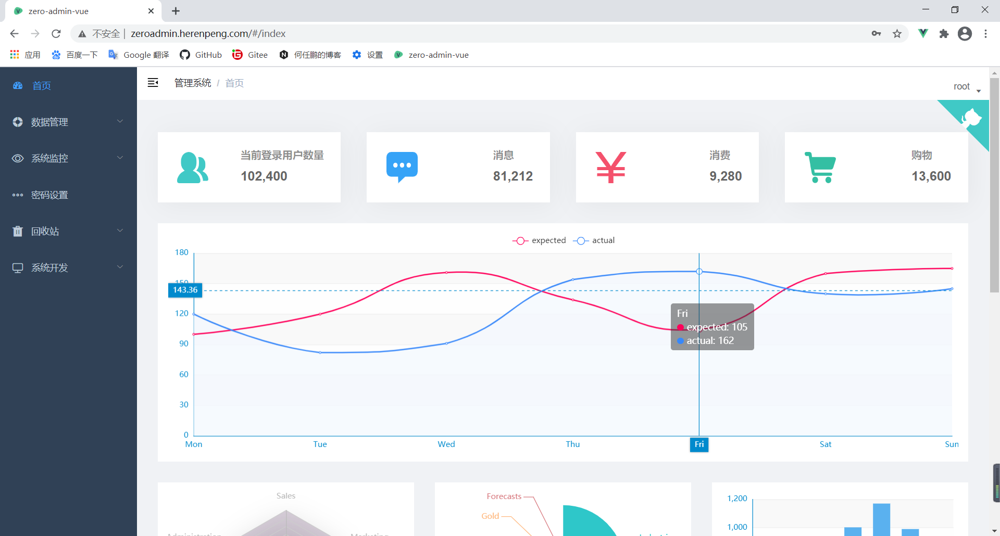

- 用户管理

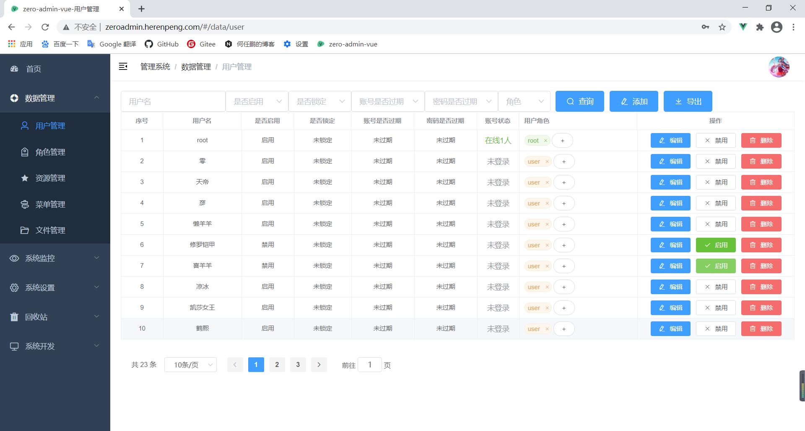

- 新增用户

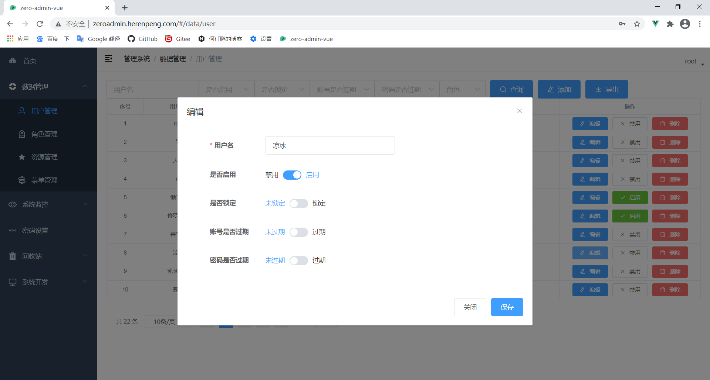

- 账号管理

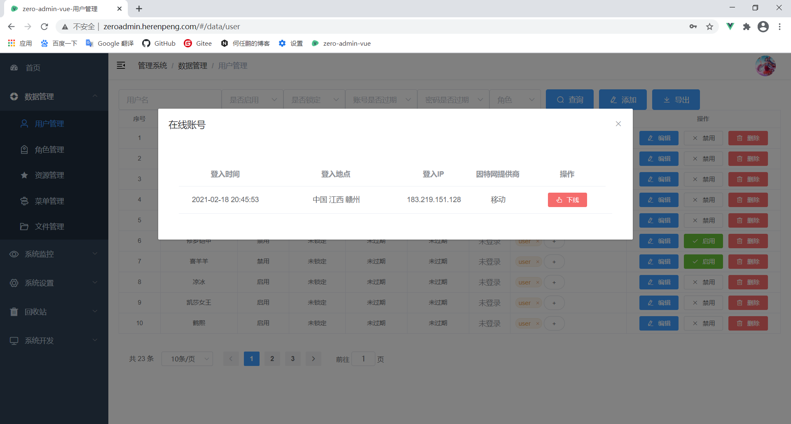

- 菜单管理

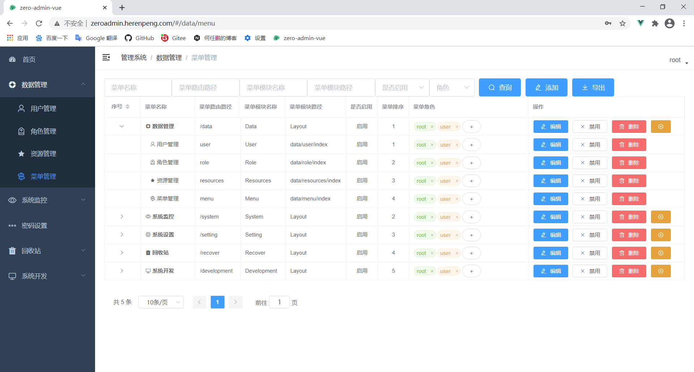

- 系统监控

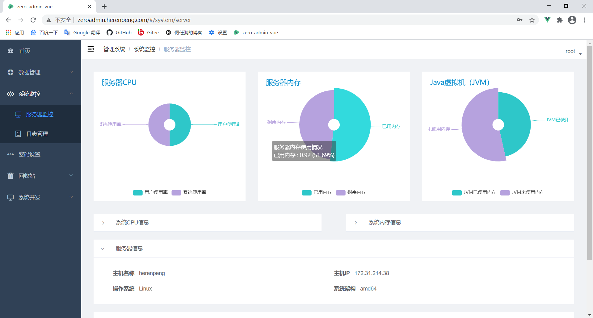

- 登入日志


- 日志管理

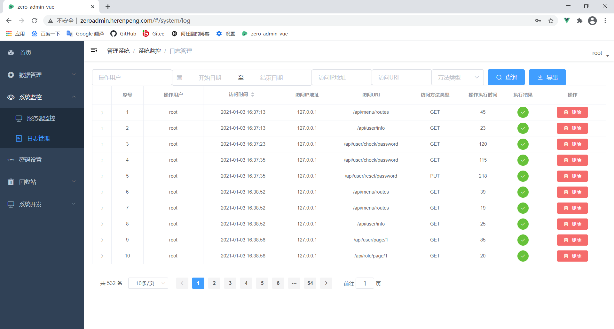

- 密码重置

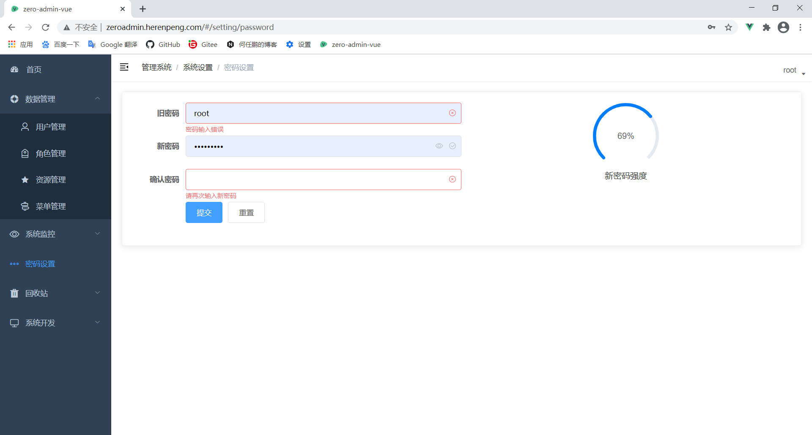

- 系统配置

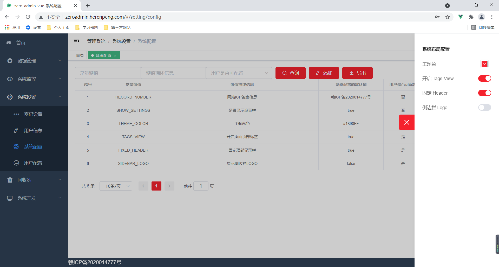

- 数据回收

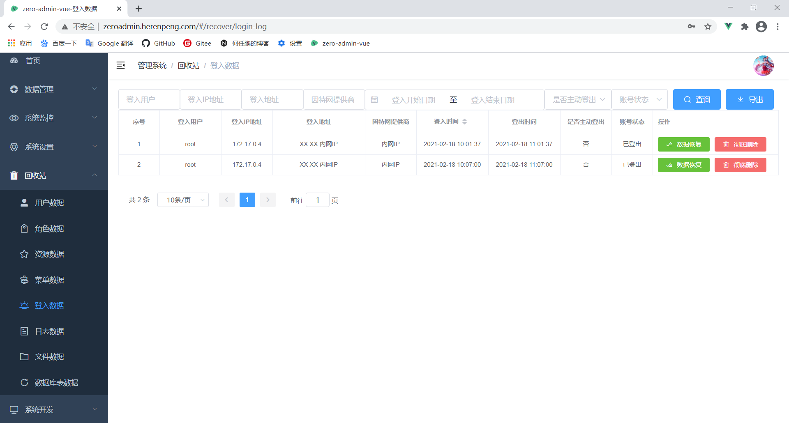

- 代码生成

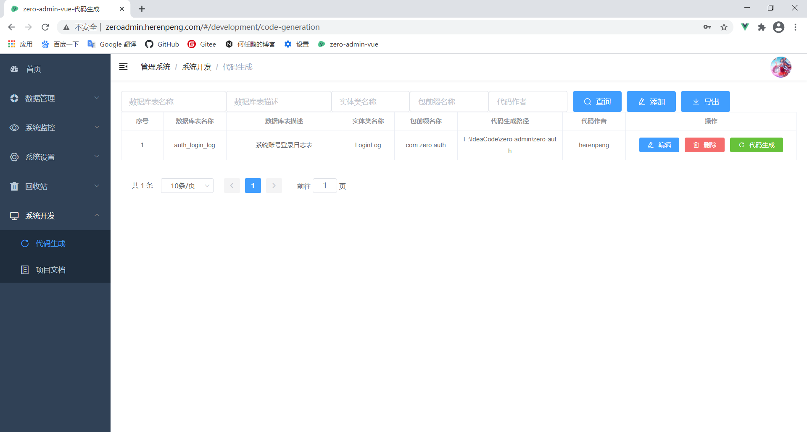

- 系统文档

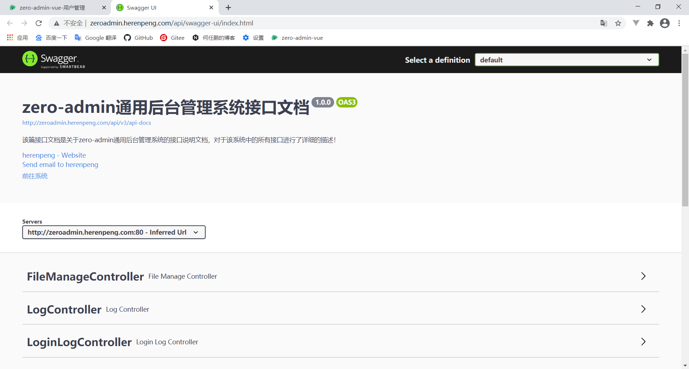
